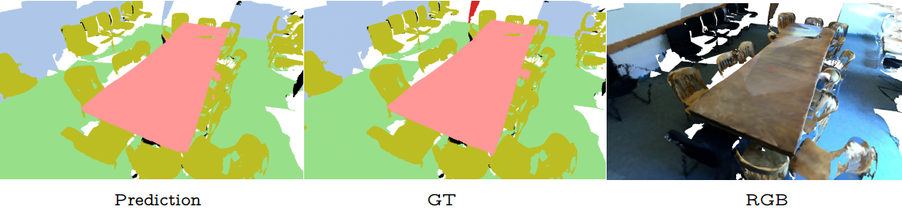

# PointConv (refactoring)

[](https://github.com/marketplace/actions/super-linter)


## Introduction
<p align="center">  </p>
This repository contatins a refactoring of the [original PointConv repository](https://github.com/DylanWusee/pointconv) of the paper [_PointConv: Deep Convolutional Networks on 3D Point Clouds_](https://arxiv.org/abs/1811.07246). Work on this project was done as part of the Skoltech course [Foundations of Software Engeneering](https://github.com/artonson/skoltech_fse_v2021.1). 

## About
>Unlike images which are represented in regular dense grids, 3D point clouds are irregular and unordered, hence applying convolution on them can be difficult. In this paper, we extend the dynamic filter to a new convolution operation, named PointConv. PointConv can be applied on point clouds to build deep convolutional networks. We treat convolution kernels as nonlinear functions of the local coordinates of 3D points comprised of weight and density functions. With respect to a given point, the weight functions are learned with multi-layer perceptron networks and the density functions through kernel density estimation. A novel reformulation is proposed for efficiently computing the weight functions, which allowed us to dramatically scale up the network and significantly improve its performance. The learned convolution kernel can be used to compute translation-invariant and permutation-invariant convolution on any point set in the 3D space. Besides, PointConv can also be used as deconvolution operators to propagate features from a subsampled point cloud back to its original resolution. Experiments on ModelNet40, ShapeNet, and ScanNet show that deep convolutional neural networks built on PointConv are able to achieve state-of-the-art on challenging semantic segmentation benchmarks on 3D point clouds. Besides, our experiments converting CIFAR-10 into a point cloud showed that networks built on PointConv can match the performance of convolutional networks in 2D images of a similar structure.

## Quickstart
This model uses SkаnNеt v2 dataset that is ~1.3TB. Quick start uses only one scene per train/val/test. To use more data see [Development](#Development) stage

1. Build docker image

in project directory  
```
docker build -t nahinkin/pointconv:devel-gpu .
```

or pull from docker hub with name nahinkin/pointconv:devel-gpu

2. Run docker image

```
docker run -it --name pointnet nahinkin/pointconv:devel-gpu
```

3. Download data
```
chmod +x download_examples.sh
./download_examples.sh
```

4. Preprocess data

```
chmod +x preprocess_examples.sh
./preprocess_examples.sh
```
5. Train 
```
chmod +x train_examples.sh
./train_examples.sh
```

6. Evaluate 
```
chmod +x eval_examples.sh
./eval_examples.sh
```

## Development

### Data downloading
The ScanNet dataset if taken from https://github.com/ScanNet/ScanNet. It is only allowed to use in non-commercial applications.

To reproduce the results from the paper one can download the whole dataset with help of `scannet/download-scannet.py`
Scan data is named by scene\[spaceid]\_[scanid], or scene%04d_%02d, where each space corresponds to a unique location (0-indexed).

To download the entire ScanNet release (~1.3TB):
```
test/download-scannet.py -o <directory in which to download>
```
To download a specific scan (e.g., scene0000_00): 
```
download-scannet.py -o <directory in which to download> --id scene0000_00
```

Train/test splits are given in the main ScanNet project repository: https://github.com/ScanNet/ScanNet/tree/master/Tasks/Benchmark

### Data preprocessing
To preprocess data one need to run:
```
cd scannet
python scannetv2_seg_dataset_rgb21c_pointid.py --root <path to downloaded dataset> --is_example False
```
This script would look for files in `<path to downloaded dataset>` based on scene titles in `scannet/scannetv2_{train,val,test}.txt`. The result would be `scannet/scannet_{train,val,test}_rgb21c_pointid.pickle` files respectively.

